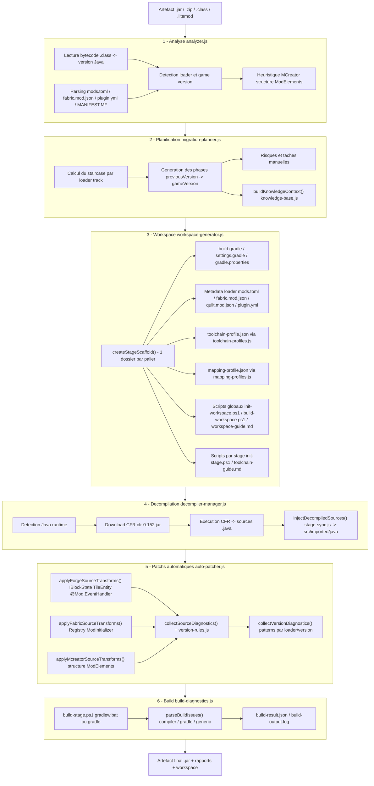
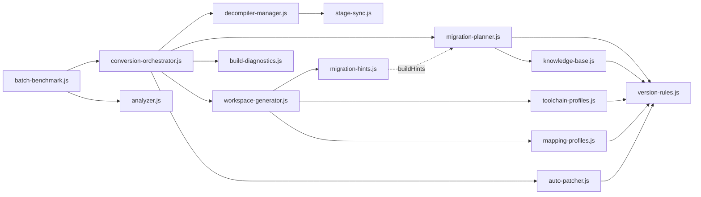
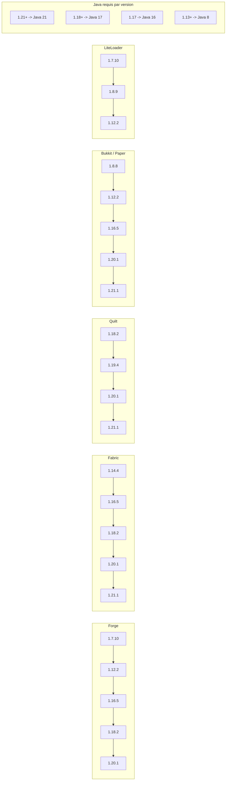
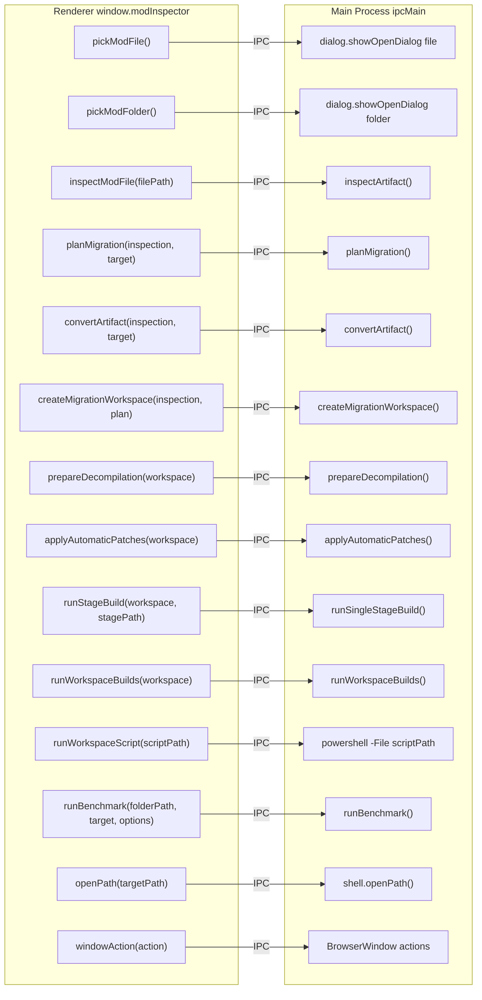
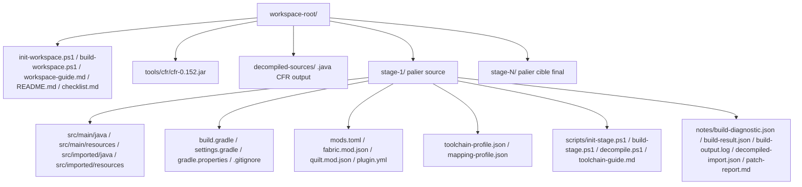

# Mod Version Inspector — Architecture détaillée

## 1. Vue d'ensemble des modules

```mermaid
graph TD
    MAIN["main.js - Electron Main Process"]
    PRELOAD["preload.js - contextBridge"]

    MAIN -->|IPC handlers| PRELOAD

    subgraph SRC["src/ - Modules metier"]
        ANALYZER["analyzer.js - inspectArtifact()"]
        PLANNER["migration-planner.js - planMigration()"]
        WORKSPACE["workspace-generator.js - createMigrationWorkspace()"]
        ORCHESTRATOR["conversion-orchestrator.js - convertArtifact()"]
        PATCHER["auto-patcher.js - applyAutomaticPatches()"]
        DECOMPILER["decompiler-manager.js - prepareDecompilation()"]
        BUILD_DIAG["build-diagnostics.js - runWorkspaceBuilds()"]
        BATCH["batch-benchmark.js - runBenchmark()"]
        STAGE_SYNC["stage-sync.js - injectDecompiledSources()"]
        KB["knowledge-base.js - buildKnowledgeContext()"]
        MAPPING["mapping-profiles.js - resolveMappingProfile()"]
        TOOLCHAIN["toolchain-profiles.js - resolveToolchainProfile()"]
        HINTS["migration-hints.js - buildHints()"]
        VERSION["version-rules.js - compareVersions()"]
    end

    MAIN --> ANALYZER
    MAIN --> PLANNER
    MAIN --> WORKSPACE
    MAIN --> ORCHESTRATOR
    MAIN --> PATCHER
    MAIN --> DECOMPILER
    MAIN --> BUILD_DIAG
    MAIN --> BATCH
```

## 2. Pipeline de conversion

## 3. Dependances entre modules

## 4. Loader tracks et staircase

## 5. IPC Electron — API exposee au renderer

## 6. Structure des fichiers generes par stage

